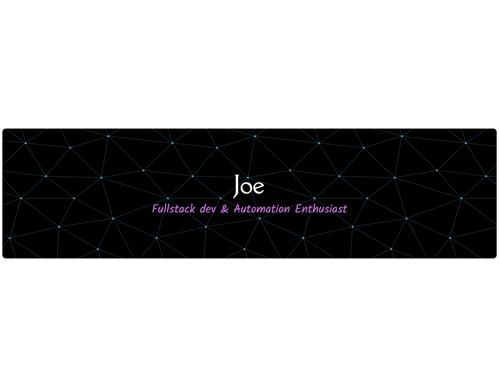

# Hello World! I'm Admojo Cahyo 👋

## 🛠️ Tech Stack & Skills

## About Me

- 🔭 I'm a passionate self-taught programmer, currently mastering **JavaScript** and **Python**
- 💼 As a businessman, efficiency and automation are my game—always exploring new ways to enhance productivity.
- 🌐 I love exploring technology and discovering new tools that can solve real-world problems.
- 💹 Actively engaged in **cryptocurrency** and **stock markets**, always learning and adapting.
- 🤝 I'm open to collaborating with like-minded people, especially in tech, automation, or finance.

## Learning Journey

- 🌱 Learning is a continuous journey for me—I'm currently diving deeper into both **frontend** and **backend**
  development.
- 🤖 My passion for automation keeps growing, and coding has become my main tool to make life (and business) more
  efficient.

## Connect With Me

- 📫 Email: **admojocahyo@gmail.com**
- 👯 I'm open to collaborating on automation, finance-related systems, or exciting new tech ideas.

## GitHub Stats

  
  

  

## Automation & Business Tools

---

Excited by what you see?
Let's talk about **business**, **technology**, **automation**, or even the simple joys of **family moments**.
Feel free to reach out anytime!
